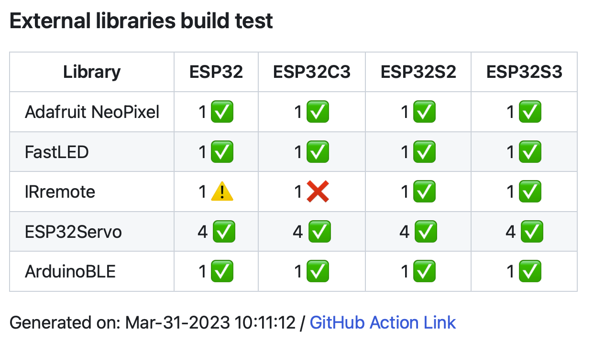
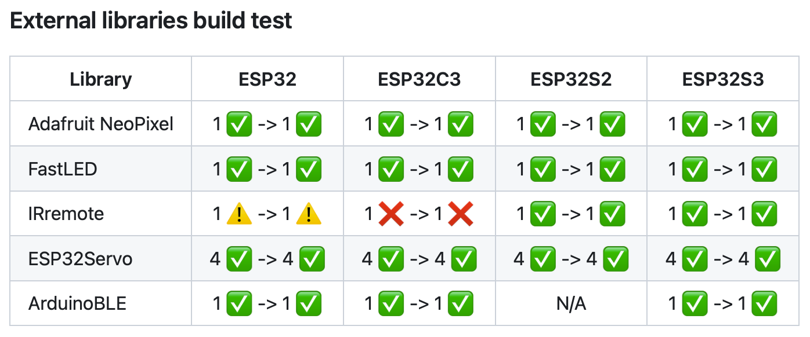

##########################
External Libraries Testing
##########################

About
-----

External libraries test is running periodicaly (once a week) agains master branch and can run on PR by adding a label "lib_test".
The test is running on all supported ESP32 chips.

How to Add Library to Test
--------------------------

Library uses peripheral which is has all chips
**********************************************

* Add new line with the library name to the list of UNIVERSAL_LIBRARIES in lib.yml file:
   
  .. code-block:: yaml

    # Libraries list to be installed
    UNIVERSAL_LIBRARIES: |
      - source-path: ./
      - name: Adafruit NeoPixel
      - name: FastLED
      - name: IRremote
      - name: ESP32Servo

* Add new line with the sketch path to the list of UNIVERSAL_SKETCHES in lib.yml file (sketch needs to be from the examples of the library):
   
  .. code-block:: yaml

    # List of sketches to build (1 for each library)
    UNIVERSAL_SKETCHES: 
      ~/Arduino/libraries/Adafruit_NeoPixel/examples/strandtest/strandtest.ino
      ~/Arduino/libraries/FastLED/examples/Blink/Blink.ino
      ~/Arduino/libraries/IRremote/examples/SendDemo/SendDemo.ino
      ~/Arduino/libraries/ESP32Servo/examples/Knob/Knob.ino

* Open a PR with the changes and someone from Espressif team will add a label "lib_test" to the PR and CI will run the 
   test to check, if the addition is fine and library / example are compiling.

* After merging your PR, the next scheduled test will test your library and add the results to the "LIBRARIES_TEST.md" file.

Library uses peripheral specific to some chips
**********************************************

* Add new line with the library name to the list of additional-libraries: under each SOC which supports the peripheral used by library in lib.yml file:
   
* Add new line with the sketch path to the list of additional-sketches under each SOC which supports the peripheral in lib.yml file 
   (sketch needs to be from the examples of the library):
   
  Example for adding ArduinoBLE library (ESP32-S2 dont have BLE peripheral)

  .. code-block:: yaml

    include:
      - fqbn: espressif:esp32:esp32
        additional-libraries: |
          - name: ArduinoBLE
        additional-sketches: |
          ~/Arduino/libraries/ArduinoBLE/examples/Central/Scan/Scan.ino
      - fqbn: espressif:esp32:esp32s2
        additional-libraries:
        additional-sketches:
      - fqbn: espressif:esp32:esp32c3
        additional-libraries: |
          - name: ArduinoBLE
        additional-sketches: |
          ~/Arduino/libraries/ArduinoBLE/examples/Central/Scan/Scan.ino
      - fqbn: espressif:esp32:esp32s3
        additional-libraries: |
          - name: ArduinoBLE
        additional-sketches: |
          ~/Arduino/libraries/ArduinoBLE/examples/Central/Scan/Scan.ino

* Open a PR with the changes and someone from Espressif team will add a label "lib_test" to the PR and CI will run the 
   test to check, if the addition is fine and library / example are compiling.

* After merging your PR, the next scheduled test will test your library and add the results to the "LIBRARIES_TEST.md" file.

Test Results
------------

Icons meaning
*************

* |success| - Compilation was successful.

* |warning| - Compilation was successful with some warnings. (number of warnings is printed next to the icon)

* |fail| - Compilation failed.

* ``N/A`` - Not tested.

Scheduled test result example
*****************************

Pull Request test result example
********************************

If the test run on Pull Request, it will compile all libraries and sketches 2 times (before/after changes in PR) to see, if the PR is breaking/fixing libraries.
In the table the results are in order "BEFORE -> AFTER".

